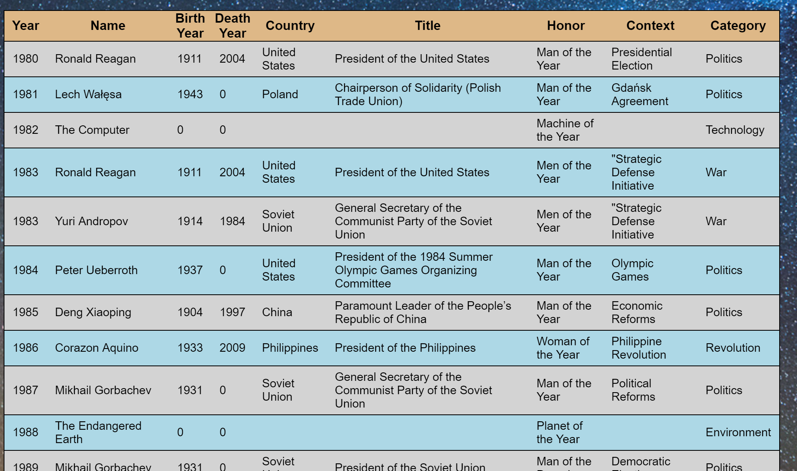
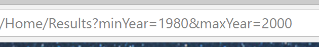

# Lab11-My-First-MVC-App
This is a demonstration of creating an Model-View-Controller (MVC) website within the .NET Core Framework. With the given .csv file, we are implementing a Time's Person of the Year search engine between the years 1927 - 2017 and listing out all results between two specified years. We are utilizing Razer Pages for our html files and practicing passing object data between different Actions.

After entering two different years, a request is sent back and will post the results in a new view. This can be denoted in the change of the url bar near the top of the browser.
***
## Getting starting
* Download the latest .NET SDK
* Navigate and download the project files from this repo
* After running the application, if your default browser pops up and you are greeted with the below image then success! Type in a start year and a
end year to be redirected to a results page displaying the filtered information
***
## What it should look like

* Landing page

* Results Page

* Url Change

***
## Resources
[Canyon Background](http://www.wallpapers13.com/milky-way-bryce-canyon-national-park-utah-united-states-desktop-wallpaper-hd-download-free-1920x1200/)
[Time Logo](https://commons.wikimedia.org/wiki/File:Time_Magazine_logo.svg)
***